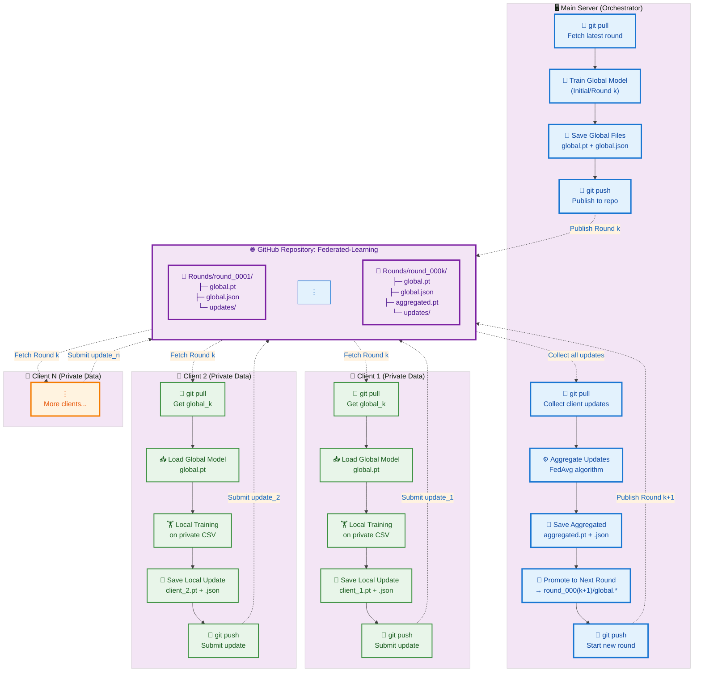

# Federated Learning Workflow

```mermaid
%%{init: {'theme':'base', 'themeVariables': { 'primaryColor':'#e3f2fd','primaryTextColor':'#1565c0','primaryBorderColor':'#1976d2','lineColor':'#424242','secondaryColor':'#fff3e0','tertiaryColor':'#f3e5f5','noteBkgColor':'#fff9c4','noteTextColor':'#33691e'}}}%%

flowchart TB
    classDef serverStyle fill:#e3f2fd,stroke:#1976d2,stroke-width:3px,color:#0d47a1
    classDef clientStyle fill:#fff3e0,stroke:#f57c00,stroke-width:3px,color:#e65100
    classDef repoStyle fill:#f3e5f5,stroke:#7b1fa2,stroke-width:3px,color:#4a148c
    classDef actionStyle fill:#e8f5e9,stroke:#388e3c,stroke-width:2px,color:#1b5e20
    classDef fileStyle fill:#fff9c4,stroke:#f9a825,stroke-width:2px,color:#f57f17

    subgraph GH["🌐 GitHub Repository: Federated-Learning"]
        direction LR
        R1["📁 Rounds/round_0001/
        ├─ global.pt
        ├─ global.json
        └─ updates/"]
        Rdots["⋮"]
        Rk["📁 Rounds/round_000k/
        ├─ global.pt
        ├─ global.json
        ├─ aggregated.pt
        └─ updates/"]
        R1 ~~~ Rdots ~~~ Rk
    end

    subgraph SV["🖥️ Main Server (Orchestrator)"]
        direction TB
        S0["🔽 git pull
        Fetch latest round"]
        S1["🧠 Train Global Model
        (Initial/Round k)"]
        S2["💾 Save Global Files
        global.pt + global.json"]
        S3["🔼 git push
        Publish to repo"]
        S4["🔽 git pull
        Collect client updates"]
        S5["⚙️ Aggregate Updates
        FedAvg algorithm"]
        S6["💾 Save Aggregated
        aggregated.pt + .json"]
        S7["🔄 Promote to Next Round
        → round_000(k+1)/global.*"]
        S8["🔼 git push
        Start new round"]
        
        S0 --> S1 --> S2 --> S3
        S4 --> S5 --> S6 --> S7 --> S8
    end

    subgraph C1["👤 Client 1 (Private Data)"]
        direction TB
        C1a["🔽 git pull
        Get global_k"]
        C1b["📥 Load Global Model
        global.pt"]
        C1c["🏋️ Local Training
        on private CSV"]
        C1d["💾 Save Local Update
        client_1.pt + .json"]
        C1e["🔼 git push
        Submit update"]
        
        C1a --> C1b --> C1c --> C1d --> C1e
    end

    subgraph C2["👤 Client 2 (Private Data)"]
        direction TB
        C2a["🔽 git pull
        Get global_k"]
        C2b["📥 Load Global Model
        global.pt"]
        C2c["🏋️ Local Training
        on private CSV"]
        C2d["💾 Save Local Update
        client_2.pt + .json"]
        C2e["🔼 git push
        Submit update"]
        
        C2a --> C2b --> C2c --> C2d --> C2e
    end

    subgraph CN["👥 Client N (Private Data)"]
        direction TB
        CNdots["⋮
        More clients..."]
    end

    %% Connections
    S3 -.->|"Publish Round k"| GH
    GH -.->|"Fetch Round k"| C1a
    GH -.->|"Fetch Round k"| C2a
    GH -.->|"Fetch Round k"| CNdots
    
    C1e -.->|"Submit update_1"| GH
    C2e -.->|"Submit update_2"| GH
    CNdots -.->|"Submit update_n"| GH
    
    GH -.->|"Collect all updates"| S4
    S8 -.->|"Publish Round k+1"| GH

    %% Styling
    class S0,S1,S2,S3,S4,S5,S6,S7,S8 serverStyle
    class C1a,C1b,C1c,C1d,C1e,C2a,C2b,C2c,C2d,C2e actionStyle
    class GH,R1,Rk repoStyle
    class CNdots clientStyle
```