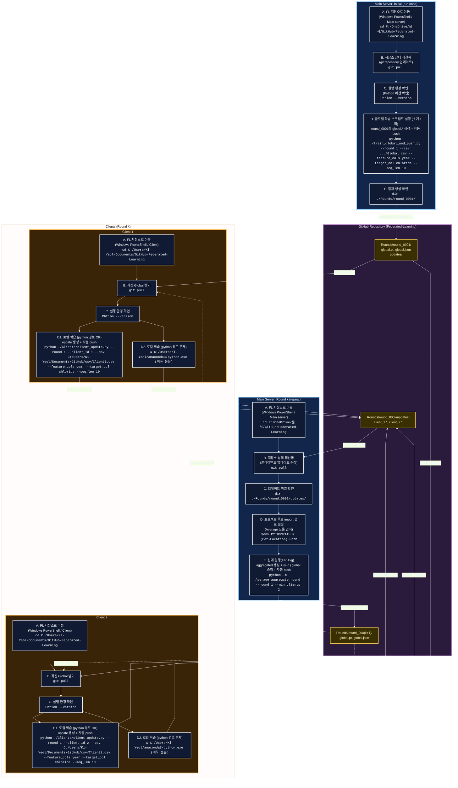

# Federated Learning Workflow

```mermaid
%%{init: {
  "theme": "base",
  "themeVariables": {
    "background": "#0b1020",
    "lineColor": "#ffffff",
    "primaryColor": "#e3f2fd",
    "primaryTextColor": "#eaf2ff",
    "primaryBorderColor": "#90caf9",
    "fontFamily": "Pretendard, Apple SD Gothic Neo, Malgun Gothic, Arial"
  },
  "flowchart": { "curve": "linear" }
}}%%

flowchart TB

classDef server fill:#12264b,stroke:#90caf9,stroke-width:3px,color:#eaf2ff
classDef client fill:#3a2408,stroke:#ffb74d,stroke-width:3px,color:#fff3e0
classDef repo fill:#2a1b3d,stroke:#ce93d8,stroke-width:3px,color:#f3e5f5
classDef step fill:#101a33,stroke:#ffffff,stroke-width:2px,color:#ffffff
classDef file fill:#3a2f00,stroke:#ffd54f,stroke-width:2px,color:#fff9c4

subgraph GH["GitHub Repository (Federated-Learning)"]
direction TB
GH_round1["Rounds/round_0001/<br/>global.pt, global.json<br/>updates/"]:::file
GH_updates["Rounds/round_000k/updates/<br/>client_1.*, client_2.*"]:::file
GH_next["Rounds/round_000(k+1)/<br/>global.pt, global.json"]:::file
end
class GH repo

subgraph SV_INIT["Main Server: Initial (run once)"]
direction TB
S_A["A. FL 저장소로 이동<br/>(Windows PowerShell / Main server)<br/><code>cd F:/OneDrive/문서/GitHub/Federated-Learning</code>"]:::step
S_B["B. 저장소 상태 최신화<br/>(git repository 업데이트)<br/><code>git pull</code>"]:::step
S_C["C. 실행 환경 확인<br/>(Python 버전 확인)<br/><code>Phtion --version</code>"]:::step
S_D["D. 글로벌 학습 스크립트 실행 (초기 1회)<br/>round_0001에 global.* 생성 + 자동 push<br/><code>python ./train_global_and_push.py --round 1 --csv .../Global.csv --feature_cols year --target_col chloride --seq_len 10</code>"]:::step
S_E["E. 결과 생성 확인<br/><code>dir ./Rounds/round_0001/</code>"]:::step
S_A --> S_B --> S_C --> S_D --> S_E
end
class SV_INIT server

subgraph SV_ROUND["Main Server: Round k (repeat)"]
direction TB
K_A["A. FL 저장소로 이동<br/>(Windows PowerShell / Main server)<br/><code>cd F:/OneDrive/문서/GitHub/Federated-Learning</code>"]:::step
K_B["B. 저장소 상태 최신화<br/>(클라이언트 업데이트 수집)<br/><code>git pull</code>"]:::step
K_C["C. 업데이트 파일 확인<br/><code>dir ./Rounds/round_0001/updates/</code>"]:::step
K_D["D. 프로젝트 루트 import 경로 설정<br/>(Average 모듈 인식)<br/><code>$env:PYTHONPATH = (Get-Location).Path</code>"]:::step
K_E["E. 집계 실행(FedAvg)<br/>aggregated 생성 + (k+1) global 승격 + 자동 push<br/><code>python -m Average.aggregate_round --round 1 --min_clients 2</code>"]:::step
K_A --> K_B --> K_C --> K_D --> K_E
end
class SV_ROUND server

subgraph CLIENTS["Clients (Round k)"]
direction LR

subgraph C1["Client 1"]
direction TB
C1_A["A. FL 저장소로 이동<br/>(Windows PowerShell / Client)<br/><code>cd C:/Users/Ki-Yeol/Documents/GitHub/Federated-Learning</code>"]:::step
C1_B["B. 최신 Global 받기<br/><code>git pull</code>"]:::step
C1_C["C. 실행 환경 확인<br/><code>Phtion --version</code>"]:::step
C1_D1["D1. 로컬 학습 (python 경로 OK)<br/>update 생성 + 자동 push<br/><code>python ./Clients/client_update.py --round 1 --client_id 1 --csv C:/Users/Ki-Yeol/Documents/GitHub/csv/Client1.csv --feature_cols year --target_col chloride --seq_len 10</code>"]:::step
C1_D2["D2. 로컬 학습 (python 경로 문제)<br/><code>&amp; C:/Users/Ki-Yeol/anaconda3/python.exe (이하 동문)</code>"]:::step
C1_A --> C1_B --> C1_C --> C1_D1
C1_C --> C1_D2
end
class C1 client

subgraph C2["Client 2"]
direction TB
C2_A["A. FL 저장소로 이동<br/>(Windows PowerShell / Client)<br/><code>cd C:/Users/Ki-Yeol/Documents/GitHub/Federated-Learning</code>"]:::step
C2_B["B. 최신 Global 받기<br/><code>git pull</code>"]:::step
C2_C["C. 실행 환경 확인<br/><code>Phtion --version</code>"]:::step
C2_D1["D1. 로컬 학습 (python 경로 OK)<br/>update 생성 + 자동 push<br/><code>python ./Clients/client_update.py --round 1 --client_id 2 --csv C:/Users/Ki-Yeol/Documents/GitHub/csv/Client2.csv --feature_cols year --target_col chloride --seq_len 10</code>"]:::step
C2_D2["D2. 로컬 학습 (python 경로 문제)<br/><code>&amp; C:/Users/Ki-Yeol/anaconda3/python.exe (이하 동문)</code>"]:::step
C2_A --> C2_B --> C2_C --> C2_D1
C2_C --> C2_D2
end
class C2 client

end

S_E -->|"Publish global (round 1)"| GH_round1
GH_round1 -->|"Fetch global_k"| C1_B
GH_round1 -->|"Fetch global_k"| C2_B

C1_D1 -->|"Submit update_1"| GH_updates
C2_D1 -->|"Submit update_2"| GH_updates
C1_D2 -->|"Submit update_1"| GH_updates
C2_D2 -->|"Submit update_2"| GH_updates

GH_updates -->|"Collect updates"| K_B
K_E -->|"Publish next global"| GH_next
GH_next -. "Next round (k+1)" .-> C1_B
GH_next -. "Next round (k+1)" .-> C2_B

```