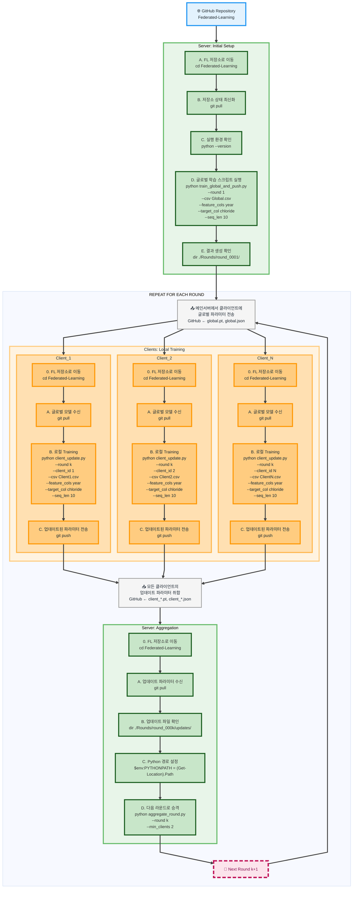

```mermaid
%%{init: {
  "theme":"base",
  "themeVariables": { "fontSize":"12px" },
  "flowchart": { "htmlLabels": true, "curve": "linear" }
}}%%

flowchart TD

%% ✅ Server 색상만 조정
%% - serverSmall: 서버에서 작동하는 "작은 박스" (진한 녹색)
%% - serverWrap:  서버에서 작동하는 "큰 박스(서브그래프)" (옅은 녹색)
classDef serverSmall fill:#c8e6c9,stroke:#1b5e20,stroke-width:3px
classDef serverWrap fill:#e8f5e9,stroke:#66bb6a,stroke-width:3px,color:#1f2933
classDef clientBox fill:#ffcc80,stroke:#ff9800,stroke-width:3px,color:#1f2933
classDef client fill:#ffe0b2,stroke:#ffb74d,stroke-width:3px,color:#1f2933
classDef clientSection fill:#fff3e0,stroke:#ffcc80,stroke-width:3px,color:#1f2933
classDef repo fill:#e3f2fd,stroke:#2196f3,stroke-width:3px,color:#1f2933
classDef step fill:#ffffff,stroke:#616161,stroke-width:2px,color:#1f2933
classDef file fill:#f5f5f5,stroke:#9e9e9e,stroke-width:2px,color:#1f2933
classDef repeat fill:#fce4ec,stroke:#c2185b,stroke-width:4px,stroke-dasharray: 10 5,color:#880e4f

linkStyle default stroke:#424242,stroke-width:2.5px

GH["🌐 GitHub Repository<br/>Federated-Learning"]:::repo

subgraph INIT["Server: Initial Setup"]
direction TB
S_A["A. FL 저장소로 이동<br/>cd Federated-Learning"]:::serverSmall
S_B["B. 저장소 상태 최신화<br/>git pull"]:::serverSmall
S_C["C. 실행 환경 확인<br/>python --version"]:::serverSmall
S_D["D. 글로벌 학습 스크립트 실행<br/>python train_global_and_push.py<br/>--round 1<br/>--csv Global.csv<br/>--feature_cols year<br/>--target_col chloride<br/>--seq_len 10"]:::serverSmall
S_E["E. 결과 생성 확인<br/>dir ./Rounds/round_0001/"]:::serverSmall
S_A --> S_B --> S_C --> S_D --> S_E
end

subgraph REPEAT["REPEAT FOR EACH ROUND"]
direction TB

PUBLISH["📤 메인서버에서 클라이언트에<br/>글로벌 파라미터 전송<br/>GitHub ← global.pt, global.json"]:::file

subgraph CLIENTS_SECTION["Clients: Local Training"]
direction TB

subgraph C1[Client_1]
direction TB
C1_0["0. FL 저장소로 이동<br/>cd Federated-Learning"]:::clientBox
C1_A["A. 글로벌 모델 수신<br/>git pull"]:::clientBox
C1_B["B. 로컬 Training<br/>python client_update.py<br/>--round k<br/>--client_id 1<br/>--csv Client1.csv<br/>--feature_cols year<br/>--target_col chloride<br/>--seq_len 10"]:::clientBox
C1_C["C. 업데이트된 파라미터 전송<br/>git push"]:::clientBox
C1_0 --> C1_A --> C1_B --> C1_C
end

subgraph C2[Client_2]
direction TB
C2_0["0. FL 저장소로 이동<br/>cd Federated-Learning"]:::clientBox
C2_A["A. 글로벌 모델 수신<br/>git pull"]:::clientBox
C2_B["B. 로컬 Training<br/>python client_update.py<br/>--round k<br/>--client_id 2<br/>--csv Client2.csv<br/>--feature_cols year<br/>--target_col chloride<br/>--seq_len 10"]:::clientBox
C2_C["C. 업데이트된 파라미터 전송<br/>git push"]:::clientBox
C2_0 --> C2_A --> C2_B --> C2_C
end

subgraph CN[Client_N]
direction TB
CN_0["0. FL 저장소로 이동<br/>cd Federated-Learning"]:::clientBox
CN_A["A. 글로벌 모델 수신<br/>git pull"]:::clientBox
CN_B["B. 로컬 Training<br/>python client_update.py<br/>--round k<br/>--client_id N<br/>--csv ClientN.csv<br/>--feature_cols year<br/>--target_col chloride<br/>--seq_len 10"]:::clientBox
CN_C["C. 업데이트된 파라미터 전송<br/>git push"]:::clientBox
CN_0 --> CN_A --> CN_B --> CN_C
end

end

COLLECT["📥 모든 클라이언트의<br/>업데이트 파라미터 취합<br/>GitHub ← client_*.pt, client_*.json"]:::file

subgraph SERVER_AGG["Server: Aggregation"]
direction TB
K_0["0. FL 저장소로 이동<br/>cd Federated-Learning"]:::serverSmall
K_A["A. 업데이트 파라미터 수신<br/>git pull"]:::serverSmall
K_B["B. 업데이트 파일 확인<br/>dir ./Rounds/round_000k/updates/"]:::serverSmall
K_C["C. Python 경로 설정<br/>$env:PYTHONPATH = (Get-Location).Path"]:::serverSmall
K_D["D. 다음 라운드로 승격<br/>python aggregate_round.py<br/>--round k<br/>--min_clients 2"]:::serverSmall
K_0 --> K_A --> K_B --> K_C --> K_D
end

REPEAT_END["🔄 Next Round k+1"]:::repeat
K_D --> REPEAT_END

end

GH --> INIT
S_E --> PUBLISH

REPEAT_END --> PUBLISH

PUBLISH --> C1
PUBLISH --> C2
PUBLISH --> CN

C1_C --> COLLECT
C2_C --> COLLECT
CN_C --> COLLECT

COLLECT --> SERVER_AGG

class S_A,S_B,S_C,S_D,S_E,K_0,K_A,K_B,K_C,K_D serverSmall

style INIT fill:#e8f5e9,stroke:#66bb6a,stroke-width:3px
style SERVER_AGG fill:#e8f5e9,stroke:#66bb6a,stroke-width:3px

class CLIENTS_SECTION clientSection
class C1 client
class C2 client
class CN client
```
