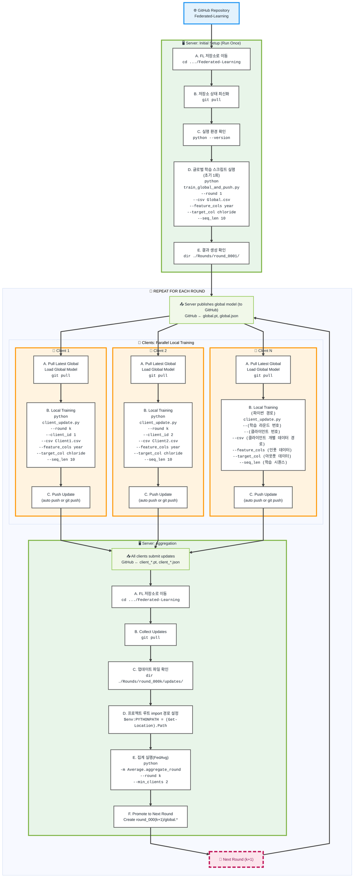

```mermaid
%%{init: {
  "theme":"base",
  "themeVariables": { "fontSize":"12px" },
  "flowchart": { "htmlLabels": true, "curve": "linear" }
}}%%

flowchart TD

classDef server fill:#e8f5e9,stroke:#7cb342,stroke-width:3px,color:#1f2933
classDef client fill:#fff3e0,stroke:#ff9800,stroke-width:3px,color:#1f2933
classDef repo fill:#e3f2fd,stroke:#2196f3,stroke-width:3px,color:#1f2933
classDef step fill:#ffffff,stroke:#616161,stroke-width:2px,color:#1f2933
classDef file fill:#f1f8e9,stroke:#9ccc65,stroke-width:2px,color:#1f2933
classDef repeat fill:#fce4ec,stroke:#c2185b,stroke-width:4px,stroke-dasharray: 10 5,color:#880e4f

linkStyle default stroke:#424242,stroke-width:2.5px

GH["🌐 GitHub Repository<br/>Federated-Learning"]:::repo

subgraph INIT["🖥️ Server: Initial Setup (Run Once)"]
direction TB
S_A["A. FL 저장소로 이동<br/><code>cd .../Federated-Learning</code>"]:::step
S_B["B. 저장소 상태 최신화<br/><code>git pull</code>"]:::step
S_C["C. 실행 환경 확인<br/><code>python --version</code>"]:::step
S_D["D. 글로벌 학습 스크립트 실행<br/>(초기 1회)<br/><code>python<br/>train_global_and_push.py<br/>--round 1<br/>--csv Global.csv<br/>--feature_cols year<br/>--target_col chloride<br/>--seq_len 10</code>"]:::step
S_E["E. 결과 생성 확인<br/><code>dir ./Rounds/round_0001/</code>"]:::step
S_A --> S_B --> S_C --> S_D --> S_E
end
class INIT server

subgraph REPEAT["🔄 REPEAT FOR EACH ROUND"]
direction TB

%% ✅ 서버 퍼블리시 박스
PUBLISH["📤 Server publishes global model (to GitHub)<br/>GitHub ← global.pt, global.json"]:::file

subgraph CLIENTS_SECTION["👥 Clients: Parallel Local Training"]
direction LR

subgraph C1["👤 Client 1"]
direction TB
C1_A["A. Pull Latest Global<br/>Load Global Model<br/><code>git pull</code>"]:::step
C1_B["B. Local Training<br/><code>python<br/>client_update.py <br/>--round k <br/>--client_id 1 <br/>--csv Client1.csv <br/>--feature_cols year <br/>--target_col chloride <br/>--seq_len 10</code>"]:::step
C1_C["C. Push Update<br/>(auto push or git push)"]:::step
C1_A --> C1_B --> C1_C
end
class C1 client

subgraph C2["👤 Client 2"]
direction TB
C2_A["A. Pull Latest Global<br/>Load Global Model<br/><code>git pull</code>"]:::step
C2_B["B. Local Training<br/><code>python<br/>client_update.py <br/>--round k <br/>--client_id 2 <br/>--csv Client2.csv <br/>--feature_cols year <br/>--target_col chloride <br/>--seq_len 10</code>"]:::step
C2_C["C. Push Update<br/>(auto push or git push)"]:::step
C2_A --> C2_B --> C2_C
end
class C2 client

subgraph CN["👤 Client N"]
direction TB
CN_A["A. Pull Latest Global<br/>Load Global Model<br/><code>git pull</code>"]:::step
CN_B["B. Local Training<br/><code>(파이썬 경로)<br/>client_update.py <br/>--(학습 라운드 번호) <br/>--(클라이언트 번호) <br/>--csv (클라이언트 개별 데이터 경로) <br/>--feature_cols (인풋 데이터) <br/>--target_col (아웃풋 데이터) <br/>--seq_len (학습 시퀀스)</code>"]:::step
CN_C["C. Push Update<br/>(auto push or git push)"]:::step
CN_A --> CN_B --> CN_C
end
class CN client

end


subgraph SERVER_AGG["🖥️ Server: Aggregation"]
direction TB
COLLECT["📥 All clients submit updates<br/>GitHub ← client_*.pt, client_*.json"]:::file
K_A["A. FL 저장소로 이동<br/><code>cd .../Federated-Learning</code>"]:::step
K_B["B. Collect Updates<br/><code>git pull</code>"]:::step
K_C["C. 업데이트 파일 확인<br/><code>dir ./Rounds/round_000k/updates/</code>"]:::step
K_D["D. 프로젝트 루트 import 경로 설정<br/><code>$env:PYTHONPATH = (Get-Location).Path</code>"]:::step
K_E["E. 집계 실행(FedAvg)<br/><code>python<br/>-m Average.aggregate_round<br/>--round k<br/>--min_clients 2</code>"]:::step
K_F["F. Promote to Next Round<br/>Create round_000(k+1)/global.*"]:::step
COLLECT --> K_A --> K_B --> K_C --> K_D --> K_E --> K_F
end
class SERVER_AGG server

REPEAT_END["🔄 Next Round (k+1)"]:::repeat
K_F --> REPEAT_END
end

%% =========================
%% 연결 (필요한 것만)
%% =========================
GH --> S_A
S_E --> PUBLISH

%% ✅ 요청: Next Round (k+1) -> Server publishes global model 연결
REPEAT_END --> PUBLISH

PUBLISH --> C1_A
PUBLISH --> C2_A
PUBLISH --> CN_A

C1_C --> COLLECT
C2_C --> COLLECT
CN_C --> COLLECT
```
