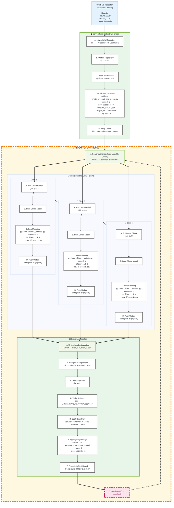

# Federated Learning Workflow

```mermaid
%%{init: {
  "theme":"base",
  "themeVariables": { "fontSize":"12px" },
  "flowchart": { "htmlLabels": true, "curve": "linear" }
}}%%

flowchart TD

classDef server fill:#e8f5e9,stroke:#7cb342,stroke-width:3px,color:#1f2933
classDef client fill:#fff3e0,stroke:#ff9800,stroke-width:3px,color:#1f2933
classDef repo fill:#e3f2fd,stroke:#2196f3,stroke-width:3px,color:#1f2933
classDef step fill:#ffffff,stroke:#616161,stroke-width:2px,color:#1f2933
classDef file fill:#f1f8e9,stroke:#9ccc65,stroke-width:2px,color:#1f2933
classDef repeat fill:#fce4ec,stroke:#c2185b,stroke-width:4px,stroke-dasharray: 10 5,color:#880e4f

linkStyle default stroke:#424242,stroke-width:2.5px

GH["🌐 GitHub Repository<br/>Federated-Learning<br/><br/>Rounds/<br/>- round_0001/<br/>- round_000k/<br/>- round_000(k+1)/"]:::repo

subgraph INIT["🖥️ Server: Initial Setup (Run Once)"]
direction TB
S_A["A. Navigate to Repository<br/><code>cd .../Federated-Learning</code>"]:::step
S_B["B. Update Repository<br/><code>git pull</code>"]:::step
S_C["C. Check Environment<br/><code>python --version</code>"]:::step
S_D["D. Initialize Global Model<br/><code>python train_global_and_push.py</code><br/><code>--round 1</code><br/><code>--csv Global.csv</code><br/><code>--feature_cols year</code><br/><code>--target_col chloride</code><br/><code>--seq_len 10</code>"]:::step
S_E["E. Verify Output<br/><code>dir ./Rounds/round_0001/</code>"]:::step
S_A --> S_B --> S_C --> S_D --> S_E
end
class INIT server

GH --> S_A

subgraph REPEAT["🔄 REPEAT FOR EACH ROUND"]
direction TB

REPEAT_START["📤 Server publishes global model (to GitHub)<br/>GitHub ← global.pt, global.json"]:::file

subgraph PARALLEL[" "]
direction LR

subgraph SERVER_AGG["🖥️ Server: Aggregation"]
direction TB

%% ✅ COLLECT를 서버 박스 상단에 고정(가장 안정적)
COLLECT["📥 All clients submit updates<br/>GitHub ← client_*.pt, client_*.json"]:::file

K_A["A. Navigate to Repository<br/><code>cd .../Federated-Learning</code>"]:::step
K_B["B. Collect Updates<br/><code>git pull</code>"]:::step
K_C["C. Verify Updates<br/><code>dir ./Rounds/round_000k/updates/</code>"]:::step
K_D["D. Set Python Path<br/><code>$env:PYTHONPATH = (Get-Location).Path</code>"]:::step
K_E["E. Aggregate (FedAvg)<br/><code>python -m Average.aggregate_round</code><br/><code>--round k</code><br/><code>--min_clients 2</code>"]:::step
K_F["F. Promote to Next Round<br/>Create round_000(k+1)/global.*"]:::step

COLLECT --> K_A --> K_B --> K_C --> K_D --> K_E --> K_F
end
class SERVER_AGG server

subgraph CLIENTS_SECTION["👥 Clients: Parallel Local Training"]
direction LR

subgraph C1["👤 Client 1"]
direction TB
C1_A["A. Pull Latest Global<br/><code>git pull</code>"]:::step
C1_B["B. Load Global Model"]:::step
C1_C["C. Local Training<br/><code>python client_update.py</code><br/><code>--round k</code><br/><code>--client_id 1</code><br/><code>--csv Client1.csv</code>"]:::step
C1_D["D. Push Update<br/>(auto push or git push)"]:::step
C1_A --> C1_B --> C1_C --> C1_D
end
class C1 client

subgraph C2["👤 Client 2"]
direction TB
C2_A["A. Pull Latest Global<br/><code>git pull</code>"]:::step
C2_B["B. Load Global Model"]:::step
C2_C["C. Local Training<br/><code>python client_update.py</code><br/><code>--round k</code><br/><code>--client_id 2</code><br/><code>--csv Client2.csv</code>"]:::step
C2_D["D. Push Update<br/>(auto push or git push)"]:::step
C2_A --> C2_B --> C2_C --> C2_D
end
class C2 client

subgraph CN["👤 Client N"]
direction TB
CN_A["A. Pull Latest Global<br/><code>git pull</code>"]:::step
CN_B["B. Load Global Model"]:::step
CN_C["C. Local Training<br/><code>python client_update.py</code><br/><code>--round k</code><br/><code>--client_id N</code><br/><code>--csv ClientN.csv</code>"]:::step
CN_D["D. Push Update<br/>(auto push or git push)"]:::step
CN_A --> CN_B --> CN_C --> CN_D
end
class CN client

C1 ~~~ C2 ~~~ CN
end

end

%% 흐름 연결
S_E --> REPEAT_START
REPEAT_START --> C1_A
REPEAT_START --> C2_A
REPEAT_START --> CN_A

%% 클라이언트 제출 → 서버 박스 상단(COLLECT)로 바로 연결
C1_D --> COLLECT
C2_D --> COLLECT
CN_D --> COLLECT

REPEAT_END["🔄 Next Round (k+1)<br/>Loop back"]:::repeat
K_F --> REPEAT_END
REPEAT_END -.-> REPEAT_START

end

style PARALLEL fill:none,stroke:none
style REPEAT fill:#fff8e1,stroke:#f57c00,stroke-width:5px,stroke-dasharray: 10 5

```