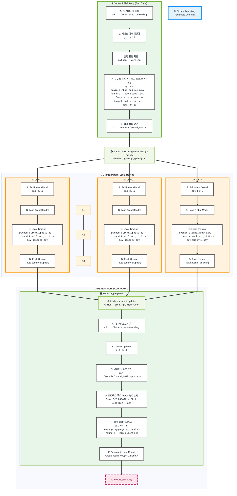

```mermaid
%%{init: {
  "theme":"base",
  "themeVariables": { "fontSize":"12px" },
  "flowchart": { "htmlLabels": true, "curve": "linear" }
}}%%

flowchart TD

classDef server fill:#e8f5e9,stroke:#7cb342,stroke-width:3px,color:#1f2933
classDef client fill:#fff3e0,stroke:#ff9800,stroke-width:3px,color:#1f2933
classDef repo fill:#e3f2fd,stroke:#2196f3,stroke-width:3px,color:#1f2933
classDef step fill:#ffffff,stroke:#616161,stroke-width:2px,color:#1f2933
classDef file fill:#f1f8e9,stroke:#9ccc65,stroke-width:2px,color:#1f2933
classDef repeat fill:#fce4ec,stroke:#c2185b,stroke-width:4px,stroke-dasharray: 10 5,color:#880e4f

linkStyle default stroke:#424242,stroke-width:2.5px

GH["🌐 GitHub Repository<br/>Federated-Learning"]:::repo

subgraph INIT["🖥️ Server: Initial Setup (Run Once)"]
direction TB
S_A["A. FL 저장소로 이동<br/><code>cd .../Federated-Learning</code>"]:::step
S_B["B. 저장소 상태 최신화<br/><code>git pull</code>"]:::step
S_C["C. 실행 환경 확인<br/><code>python --version</code>"]:::step
S_D["D. 글로벌 학습 스크립트 실행 (초기 1회)<br/><code>python train_global_and_push.py --round 1 --csv Global.csv --feature_cols year --target_col chloride --seq_len 10</code>"]:::step
S_E["E. 결과 생성 확인<br/><code>dir ./Rounds/round_0001/</code>"]:::step
S_A --> S_B --> S_C --> S_D --> S_E
end
class INIT server

%% ✅ 서버 퍼블리시 박스 (요청한 연결의 기준점)
PUBLISH["📤 Server publishes global model (to GitHub)<br/>GitHub ← global.pt, global.json"]:::file

subgraph CLIENTS_SECTION["👥 Clients: Parallel Local Training"]
direction LR

%% ===== 수평 정렬 강제(선은 안 보이게) =====

A1 --- A2 --- A3
linkStyle 0 stroke:transparent,stroke-width:0px
linkStyle 1 stroke:transparent,stroke-width:0px

subgraph C1["👤 Client 1"]
direction TB
C1_A["A. Pull Latest Global<br/><code>git pull</code>"]:::step
C1_B["B. Load Global Model"]:::step
C1_C["C. Local Training<br/><code>python client_update.py --round k --client_id 1 --csv Client1.csv</code>"]:::step
C1_D["D. Push Update<br/>(auto push or git push)"]:::step
C1_A --> C1_B --> C1_C --> C1_D
end
class C1 client

subgraph C2["👤 Client 2"]
direction TB
C2_A["A. Pull Latest Global<br/><code>git pull</code>"]:::step
C2_B["B. Load Global Model"]:::step
C2_C["C. Local Training<br/><code>python client_update.py --round k --client_id 2 --csv Client2.csv</code>"]:::step
C2_D["D. Push Update<br/>(auto push or git push)"]:::step
C2_A --> C2_B --> C2_C --> C2_D
end
class C2 client

subgraph CN["👤 Client N"]
direction TB
CN_A["A. Pull Latest Global<br/><code>git pull</code>"]:::step
CN_B["B. Load Global Model"]:::step
CN_C["C. Local Training<br/><code>python client_update.py --round k --client_id N --csv ClientN.csv</code>"]:::step
CN_D["D. Push Update<br/>(auto push or git push)"]:::step
CN_A --> CN_B --> CN_C --> CN_D
end
class CN client

end


subgraph REPEAT["🔄 REPEAT FOR EACH ROUND"]
direction TB

subgraph SERVER_AGG["🖥️ Server: Aggregation"]
direction TB
COLLECT["📥 All clients submit updates<br/>GitHub ← client_*.pt, client_*.json"]:::file
K_A["A. FL 저장소로 이동<br/><code>cd .../Federated-Learning</code>"]:::step
K_B["B. Collect Updates<br/><code>git pull</code>"]:::step
K_C["C. 업데이트 파일 확인<br/><code>dir ./Rounds/round_000k/updates/</code>"]:::step
K_D["D. 프로젝트 루트 import 경로 설정<br/><code>$env:PYTHONPATH = (Get-Location).Path</code>"]:::step
K_E["E. 집계 실행(FedAvg)<br/><code>python -m Average.aggregate_round --round k --min_clients 2</code>"]:::step
K_F["F. Promote to Next Round<br/>Create round_000(k+1)/global.*"]:::step
COLLECT --> K_A --> K_B --> K_C --> K_D --> K_E --> K_F
end
class SERVER_AGG server

REPEAT_END["🔄 Next Round (k+1)"]:::repeat
K_F --> REPEAT_END
end

%% =========================
%% ✅ 요청대로 "필요한 화살표만" 남김
%% =========================

%% 초기 생성 흐름 -> 퍼블리시
S_E --> PUBLISH

%% 퍼블리시 -> 각 클라이언트(이것만 남김)
PUBLISH --> C1_A
PUBLISH --> C2_A
PUBLISH --> CN_A

%% 클라이언트 -> 서버 업데이트 제출(이건 필요하면 유지, 필요 없으면 아래 3줄 삭제)
C1_D --> COLLECT
C2_D --> COLLECT
CN_D --> COLLECT
```
