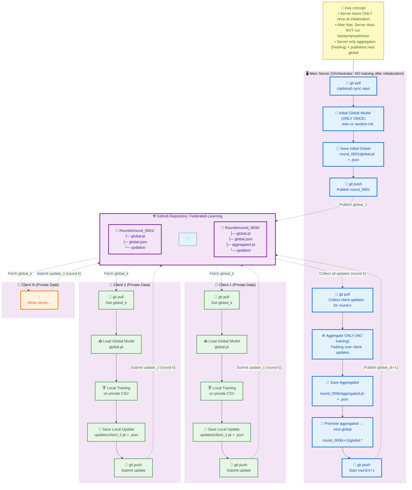

# Federated Learning Workflow

```mermaid
%%{init: {'theme':'base', 'themeVariables': { 'primaryColor':'#e3f2fd','primaryTextColor':'#1565c0','primaryBorderColor':'#1976d2','lineColor':'#424242','secondaryColor':'#fff3e0','tertiaryColor':'#f3e5f5','noteBkgColor':'#fff9c4','noteTextColor':'#33691e'}}}%%

flowchart TB
    classDef serverStyle fill:#e3f2fd,stroke:#1976d2,stroke-width:3px,color:#0d47a1
    classDef clientStyle fill:#fff3e0,stroke:#f57c00,stroke-width:3px,color:#e65100
    classDef repoStyle fill:#f3e5f5,stroke:#7b1fa2,stroke-width:3px,color:#4a148c
    classDef actionStyle fill:#e8f5e9,stroke:#388e3c,stroke-width:2px,color:#1b5e20
    classDef noteStyle fill:#fff9c4,stroke:#f9a825,stroke-width:2px,color:#33691e

    subgraph GH["🌐 GitHub Repository: Federated-Learning"]
        direction LR
        R1["📁 Rounds/round_0001/
        ├─ global.pt
        ├─ global.json
        └─ updates/"]
        Rdots["⋮"]
        Rk["📁 Rounds/round_000k/
        ├─ global.pt
        ├─ global.json
        ├─ aggregated.pt
        └─ updates/"]
        R1 ~~~ Rdots ~~~ Rk
    end

    %% =========================
    %% Main Server: 역할 분리
    %% =========================
    subgraph SV["🖥️ Main Server (Orchestrator: NO training after initialization)"]
        direction TB

        %% (A) Initialization: only once
        S0["🔽 git pull
        (optional) sync repo"]
        S_init["🧠 Initial Global Model (ONLY ONCE)
        train or random init"]
        S_save0["💾 Save Initial Global
        round_0001/global.pt + .json"]
        S_push0["🔼 git push
        Publish round_0001"]

        %% (B) Rounds: aggregation only
        S_pull["🔽 git pull
        Collect client updates for round k"]
        S_agg["⚙️ Aggregate ONLY (NO training)
        FedAvg over client updates"]
        S_savek["💾 Save Aggregated
        round_000k/aggregated.pt + .json"]
        S_promote["🔄 Promote aggregated → next global
        round_000(k+1)/global.*"]
        S_pushk["🔼 git push
        Start round k+1"]

        %% Flows
        S0 --> S_init --> S_save0 --> S_push0
        S_pull --> S_agg --> S_savek --> S_promote --> S_pushk
    end

    note1["📝 Key concept
    • Server trains ONLY once at initialization
    • After that: Server does NOT run backprop/optimizer
    • Server only aggregates (FedAvg) + publishes next global"]:::noteStyle

    %% =========================
    %% Clients
    %% =========================
    subgraph C1["👤 Client 1 (Private Data)"]
        direction TB
        C1a["🔽 git pull
        Get global_k"]
        C1b["📥 Load Global Model
        global.pt"]
        C1c["🏋️ Local Training
        on private CSV"]
        C1d["💾 Save Local Update
        updates/client_1.pt + .json"]
        C1e["🔼 git push
        Submit update"]
        C1a --> C1b --> C1c --> C1d --> C1e
    end

    subgraph C2["👤 Client 2 (Private Data)"]
        direction TB
        C2a["🔽 git pull
        Get global_k"]
        C2b["📥 Load Global Model
        global.pt"]
        C2c["🏋️ Local Training
        on private CSV"]
        C2d["💾 Save Local Update
        updates/client_2.pt + .json"]
        C2e["🔼 git push
        Submit update"]
        C2a --> C2b --> C2c --> C2d --> C2e
    end

    subgraph CN["👥 Client N (Private Data)"]
        direction TB
        CNdots["⋮
        More clients..."]
    end

    %% =========================
    %% Connections via GitHub
    %% =========================
    S_push0 -.->|"Publish global_1"| GH

    S_pushk -.->|"Publish global_(k+1)"| GH

    GH -.->|"Fetch global_k"| C1a
    GH -.->|"Fetch global_k"| C2a
    GH -.->|"Fetch global_k"| CNdots

    C1e -.->|"Submit update_1 (round k)"| GH
    C2e -.->|"Submit update_2 (round k)"| GH
    CNdots -.->|"Submit update_n (round k)"| GH

    GH -.->|"Collect all updates (round k)"| S_pull

    %% Note connection
    note1 --- SV

    %% Styling
    class S0,S_init,S_save0,S_push0,S_pull,S_agg,S_savek,S_promote,S_pushk serverStyle
    class C1a,C1b,C1c,C1d,C1e,C2a,C2b,C2c,C2d,C2e actionStyle
    class GH,R1,Rk repoStyle
    class CNdots clientStyle

```