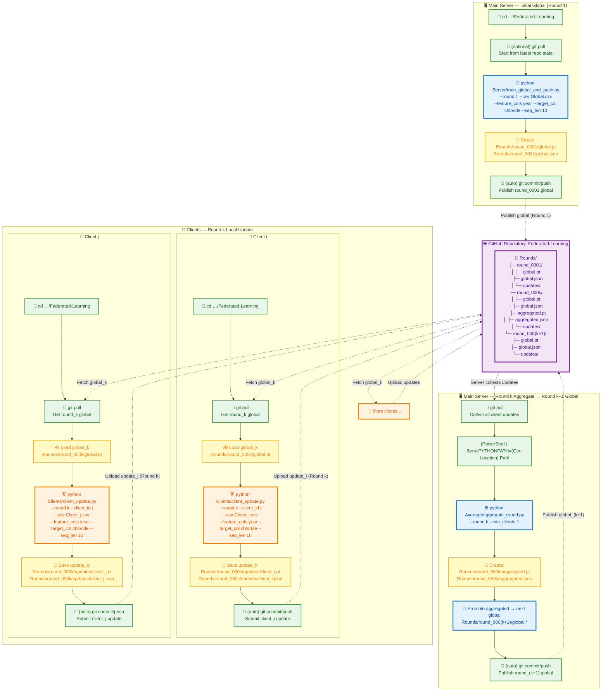

# Federated Learning Workflow

```mermaid
%%{init: {'theme':'base', 'themeVariables': { 
  /* 전체 배경(캔버스) */
  'background':'#e3f2fd',

  /* 다이어그램 기본 배경(노드/클러스터 대비용) */
  'mainBkg':'#ffffff',
  'secondaryBkg':'#fff3e0',
  'tertiaryBkg':'#f3e5f5',

  /* 화살표/선 가시성 강화 */
  'lineColor':'#0d47a1',
  'primaryBorderColor':'#0d47a1',
  'primaryTextColor':'#0d47a1',

  /* 라벨 배경(선 위 글씨 가독성) */
  'edgeLabelBackground':'#ffffff',

  /* 기존 값 유지 */
  'primaryColor':'#e3f2fd',
  'noteBkgColor':'#fff9c4',
  'noteTextColor':'#33691e'
}}}%%

flowchart TB

classDef serverStyle fill:#e3f2fd,stroke:#1976d2,stroke-width:3px,color:#0d47a1
classDef clientStyle fill:#fff3e0,stroke:#f57c00,stroke-width:3px,color:#e65100
classDef repoStyle fill:#f3e5f5,stroke:#7b1fa2,stroke-width:3px,color:#4a148c
classDef actionStyle fill:#e8f5e9,stroke:#388e3c,stroke-width:2px,color:#1b5e20
classDef fileStyle fill:#fff9c4,stroke:#f9a825,stroke-width:2px,color:#f57f17

subgraph GH["🌐 GitHub Repository: Federated-Learning"]
direction LR
R0["📁 Rounds/\n  ├─ round_0001/\n  │   ├─ global.pt\n  │   ├─ global.json\n  │   └─ updates/\n  ├─ round_000k/\n  │   ├─ global.pt\n  │   ├─ global.json\n  │   ├─ aggregated.pt\n  │   ├─ aggregated.json\n  │   └─ updates/\n  └─ round_000(k+1)/\n      ├─ global.pt\n      ├─ global.json\n      └─ updates/"]:::repoStyle
end

subgraph SV0["🖥️ Main Server — Initial Global (Round 1)"]
direction TB
SV0a["🔽 cd …/Federated-Learning"]:::actionStyle
SV0b["🔽 (optional) git pull\nStart from latest repo state"]:::actionStyle
SV0c["🧠 python Server/train_global_and_push.py\n--round 1 --csv Global.csv\n--feature_cols year --target_col chloride --seq_len 10"]:::serverStyle
SV0d["💾 Create:\nRounds/round_0001/global.pt\nRounds/round_0001/global.json"]:::fileStyle
SV0e["🔼 (auto) git commit/push\nPublish round_0001 global"]:::actionStyle
SV0a --> SV0b --> SV0c --> SV0d --> SV0e
end

subgraph CK["👥 Clients — Round k Local Update"]
direction LR

subgraph C1["👤 Client i"]
direction TB
C1a["🔽 cd …/Federated-Learning"]:::actionStyle
C1b["🔽 git pull\nGet round_k global"]:::actionStyle
C1c["📥 Load global_k\nRounds/round_000k/global.pt"]:::fileStyle
C1d["🏋️ python Clients/client_update.py\n--round k --client_id i\n--csv Client_i.csv\n--feature_cols year --target_col chloride --seq_len 10"]:::clientStyle
C1e["💾 Save update_k:\nRounds/round_000k/updates/client_i.pt\nRounds/round_000k/updates/client_i.json"]:::fileStyle
C1f["🔼 (auto) git commit/push\nSubmit client_i update"]:::actionStyle
C1a --> C1b --> C1c --> C1d --> C1e --> C1f
end

subgraph C2["👤 Client j"]
direction TB
C2a["🔽 cd …/Federated-Learning"]:::actionStyle
C2b["🔽 git pull\nGet round_k global"]:::actionStyle
C2c["📥 Load global_k\nRounds/round_000k/global.pt"]:::fileStyle
C2d["🏋️ python Clients/client_update.py\n--round k --client_id j\n--csv Client_j.csv\n--feature_cols year --target_col chloride --seq_len 10"]:::clientStyle
C2e["💾 Save update_k:\nRounds/round_000k/updates/client_j.pt\nRounds/round_000k/updates/client_j.json"]:::fileStyle
C2f["🔼 (auto) git commit/push\nSubmit client_j update"]:::actionStyle
C2a --> C2b --> C2c --> C2d --> C2e --> C2f
end

CN["⋮ More clients..."]:::clientStyle
end

subgraph SVK["🖥️ Main Server — Round k Aggregate → Round k+1 Global"]
direction TB
SVKa["🔽 git pull\nCollect all client updates"]:::actionStyle
SVKb["(PowerShell) $env:PYTHONPATH=(Get-Location).Path"]:::actionStyle
SVKc["⚙️ python Average/aggregate_round.py\n--round k --min_clients 1"]:::serverStyle
SVKd["💾 Create:\nRounds/round_000k/aggregated.pt\nRounds/round_000k/aggregated.json"]:::fileStyle
SVKe["🔄 Promote aggregated → next global\nRounds/round_000(k+1)/global.*"]:::serverStyle
SVKf["🔼 (auto) git commit/push\nPublish round_(k+1) global"]:::actionStyle
SVKa --> SVKb --> SVKc --> SVKd --> SVKe --> SVKf
end

SV0e -.->|"Publish global (Round 1)"| GH
GH -.->|"Fetch global_k"| C1b
GH -.->|"Fetch global_k"| C2b
GH -.->|"Fetch global_k"| CN

C1f -.->|"Upload update_i (Round k)"| GH
C2f -.->|"Upload update_j (Round k)"| GH
CN -.->|"Upload updates"| GH

GH -.->|"Server collects updates"| SVKa
SVKf -.->|"Publish global_(k+1)"| GH

class SV0c,SVKe,SVKc serverStyle
class C1d,C2d clientStyle
class GH,R0 repoStyle
class SV0a,SV0b,SV0e,SVKa,SVKb,SVKf,C1a,C1b,C1f,C2a,C2b,C2f actionStyle
class SV0d,SVKd,C1c,C1e,C2c,C2e fileStyle
```