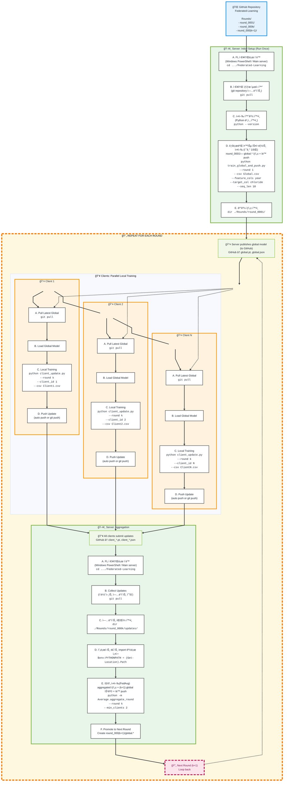

```mermaid
%%{init: {
  "theme":"base",
  "themeVariables": { "fontSize":"12px" },
  "flowchart": { "htmlLabels": true, "curve": "linear" }
}}%%

flowchart TD

classDef server fill:#e8f5e9,stroke:#7cb342,stroke-width:3px,color:#1f2933
classDef client fill:#fff3e0,stroke:#ff9800,stroke-width:3px,color:#1f2933
classDef repo fill:#e3f2fd,stroke:#2196f3,stroke-width:3px,color:#1f2933
classDef step fill:#ffffff,stroke:#616161,stroke-width:2px,color:#1f2933
classDef file fill:#f1f8e9,stroke:#9ccc65,stroke-width:2px,color:#1f2933
classDef repeat fill:#fce4ec,stroke:#c2185b,stroke-width:4px,stroke-dasharray: 10 5,color:#880e4f

linkStyle default stroke:#424242,stroke-width:2.5px

GH["🌠GitHub Repository<br/>Federated-Learning<br/><br/>Rounds/<br/>- round_0001/<br/>- round_000k/<br/>- round_000(k+1)/"]:::repo

subgraph INIT["ğŸ–¥ï¸ Server: Initial Setup (Run Once)"]
direction TB
S_A["A. FL ì €ì¥ì†Œë¡œ ì´ë™<br/>(Windows PowerShell / Main server)<br/><code>cd .../Federated-Learning</code>"]:::step
S_B["B. ì €ì¥ì†Œ ìƒíƒœ 최신화<br/>(git repository ì—…ë°ì´íŠ¸)<br/><code>git pull</code>"]:::step
S_C["C. 실행 환경 확ì¸<br/>(Python 버전 확ì¸)<br/><code>python --version</code>"]:::step
S_D["D. 글로벌 학습 스í¬ë¦½íŠ¸ 실행 (초기 1회)<br/>round_0001ì— global.* ìƒì„± + ìë™ push<br/><code>python train_global_and_push.py</code><br/><code>--round 1</code><br/><code>--csv Global.csv</code><br/><code>--feature_cols year</code><br/><code>--target_col chloride</code><br/><code>--seq_len 10</code>"]:::step
S_E["E. ê²°ê³¼ ìƒì„± 확ì¸<br/><code>dir ./Rounds/round_0001/</code>"]:::step
S_A --> S_B --> S_C --> S_D --> S_E
end
class INIT server

GH --> S_A

subgraph REPEAT["🔄 REPEAT FOR EACH ROUND"]
direction TB

REPEAT_START["📤 Server publishes global model (to GitHub)<br/>GitHub ↠global.pt, global.json"]:::file

subgraph PARALLEL[" "]
direction LR

subgraph SERVER_AGG["ğŸ–¥ï¸ Server: Aggregation"]
direction TB

%% ✅ 서버 박스 ìƒë‹¨ ê³ ì • (위치 íŠ ë°©ì§€)
COLLECT["📥 All clients submit updates<br/>GitHub ↠client_*.pt, client_*.json"]:::file

K_A["A. FL ì €ì¥ì†Œë¡œ ì´ë™<br/>(Windows PowerShell / Main server)<br/><code>cd .../Federated-Learning</code>"]:::step
K_B["B. Collect Updates<br/>(í´ë¼ì´ì–¸íŠ¸ ì—…ë°ì´íŠ¸ 수집)<br/><code>git pull</code>"]:::step
K_C["C. ì—…ë°ì´íŠ¸ íŒŒì¼ í™•ì¸<br/><code>dir ./Rounds/round_000k/updates/</code>"]:::step
K_D["D. 프로ì íŠ¸ 루트 import 경로 설정<br/><code>$env:PYTHONPATH = (Get-Location).Path</code>"]:::step
K_E["E. 집계 실행(FedAvg)<br/>aggregated ìƒì„± + (k+1) global 승격 + ìë™ push<br/><code>python -m Average.aggregate_round</code><br/><code>--round k</code><br/><code>--min_clients 2</code>"]:::step
K_F["F. Promote to Next Round<br/>Create round_000(k+1)/global.*"]:::step

COLLECT --> K_A --> K_B --> K_C --> K_D --> K_E --> K_F
end
class SERVER_AGG server

subgraph CLIENTS_SECTION["👥 Clients: Parallel Local Training"]
direction LR

subgraph C1["👤 Client 1"]
direction TB
C1_TOP[" "]
style C1_TOP fill:none,stroke:none
C1_A["A. Pull Latest Global<br/><code>git pull</code>"]:::step
C1_B["B. Load Global Model"]:::step
C1_C["C. Local Training<br/><code>python client_update.py</code><br/><code>--round k</code><br/><code>--client_id 1</code><br/><code>--csv Client1.csv</code>"]:::step
C1_D["D. Push Update<br/>(auto push or git push)"]:::step
C1_TOP --> C1_A
C1_A --> C1_B --> C1_C --> C1_D
end
class C1 client

subgraph C2["👤 Client 2"]
direction TB
C2_TOP[" "]
style C2_TOP fill:none,stroke:none
C2_A["A. Pull Latest Global<br/><code>git pull</code>"]:::step
C2_B["B. Load Global Model"]:::step
C2_C["C. Local Training<br/><code>python client_update.py</code><br/><code>--round k</code><br/><code>--client_id 2</code><br/><code>--csv Client2.csv</code>"]:::step
C2_D["D. Push Update<br/>(auto push or git push)"]:::step
C2_TOP --> C2_A
C2_A --> C2_B --> C2_C --> C2_D
end
class C2 client

subgraph CN["👤 Client N"]
direction TB
CN_TOP[" "]
style CN_TOP fill:none,stroke:none
CN_A["A. Pull Latest Global<br/><code>git pull</code>"]:::step
CN_B["B. Load Global Model"]:::step
CN_C["C. Local Training<br/><code>python client_update.py</code><br/><code>--round k</code><br/><code>--client_id N</code><br/><code>--csv ClientN.csv</code>"]:::step
CN_D["D. Push Update<br/>(auto push or git push)"]:::step
CN_TOP --> CN_A
CN_A --> CN_B --> CN_C --> CN_D
end
class CN client

%% ✅ ìˆ˜í‰ ì •ë ¬ ê°•ì œ(ì„  ì—†ì´ spacing만)
C1_TOP ~~~ C2_TOP ~~~ CN_TOP

end

end

%% =========================
%% 연결 구조 (선 정리 버전)
%% =========================

S_E --> REPEAT_START

%% ✅ 분기 허브(ë³´ì´ì§€ 않게) : ìœ„ìª½ì— ë‚¨ëŠ” êº¾ì¸ ì„  최소화
CLIENTS_FANOUT[" "]
style CLIENTS_FANOUT fill:none,stroke:none

REPEAT_START --> CLIENTS_FANOUT
CLIENTS_FANOUT -.-> C1_A
CLIENTS_FANOUT -.-> C2_A
CLIENTS_FANOUT -.-> CN_A

%% í´ë¼ì´ì–¸íŠ¸ 제출 → 서버 ìƒë‹¨ COLLECTë¡œ
C1_D --> COLLECT
C2_D --> COLLECT
CN_D --> COLLECT

REPEAT_END["🔄 Next Round (k+1)<br/>Loop back"]:::repeat
K_F --> REPEAT_END
REPEAT_END -.-> REPEAT_START

end

style PARALLEL fill:none,stroke:none
style REPEAT fill:#fff8e1,stroke:#f57c00,stroke-width:5px,stroke-dasharray: 10 5
```
